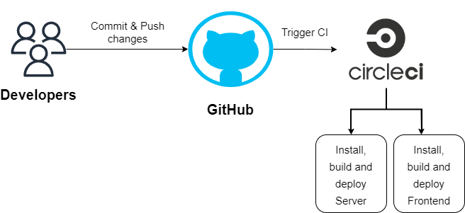

## Udagram Pipeline

### Continuous Integration

#### GitHub

The developers commit and push their code changes to the GitHub repository which is linked to the CircleCI platform.
GitHub triggers the CircleCI platform when code is pushed to the repository.

#### CircleCI

CircleCI reads the `.circleci/config.yml` file which tells the service what has to be done. In the case of Udagram,
there is a single job to be run by CircleCI and this job does the follow:

- Runs Front-end `frontend:install` script given in the `package.json` file to install front-end dependencies.
- Runs the `backend:install` script to install API dependencies.
- Runs the `frontend:build` script to build front-end.
- Runs the `backend:build` script that builds API then runs the `archive` script.
- Runs the `backend:deploy` script that uses AWS CLI to deploy the API an elastic beanstalk.
- Runs the `frontend:deploy` script that uses AWS CLI to upload assets to S3.
